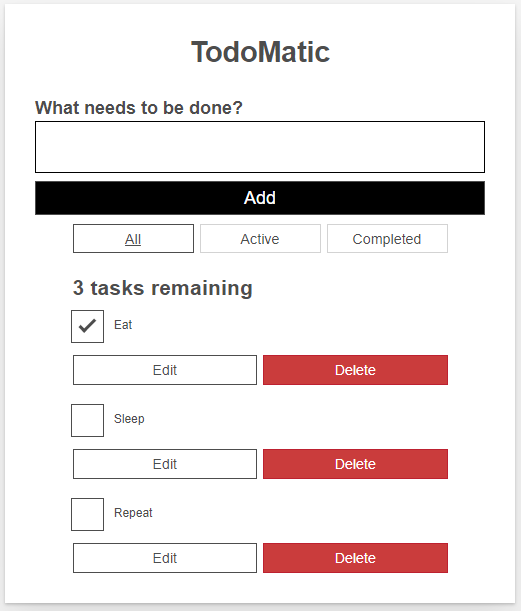

## Practice React  🚀
 
 I create this repository for practice React and learn more about this code language.
 
## Step by step

I used guide from https://developer.mozilla.org/ for create my first app in React, I choice for documentation this time, not a video learn.

Guide: [Guide in Mozilla WebSite](https://developer.mozilla.org/en-US/docs/Learn/Tools_and_testing/Client-side_JavaScript_frameworks/React_todo_list_beginning)

Our app should fulfill the following stories:

As a user, I can

- read a list of tasks.
- add a task using the mouse or keyboard.
- mark any task as completed, using the mouse or keyboard.
- delete any task, using the mouse or keyboard.
- edit any task, using the mouse or keyboard.
- view a specific subset of tasks: All tasks, only the active task, or only the completed tasks.

The app will look something like this:

In my code, I commented all changes for remember in the future.
